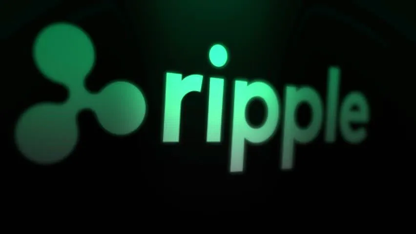
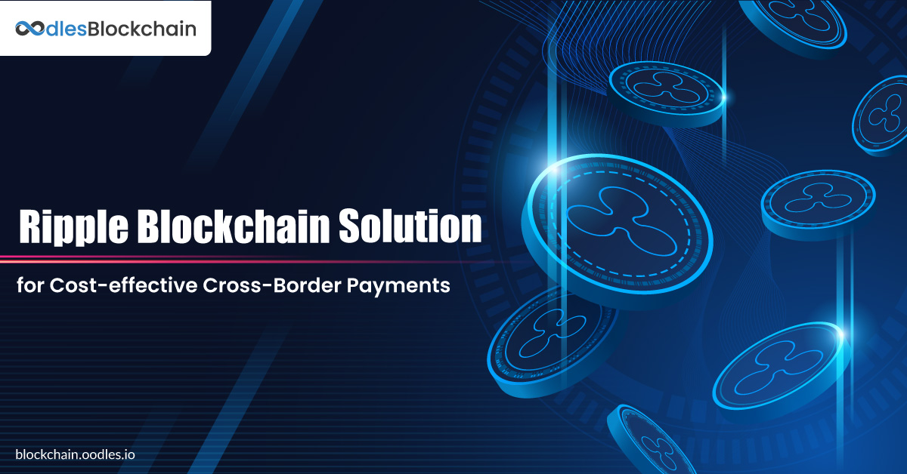
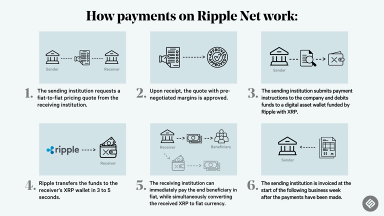
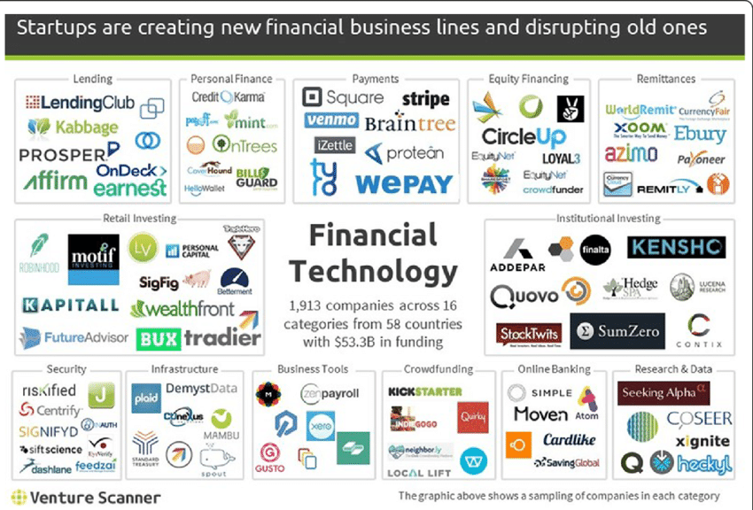
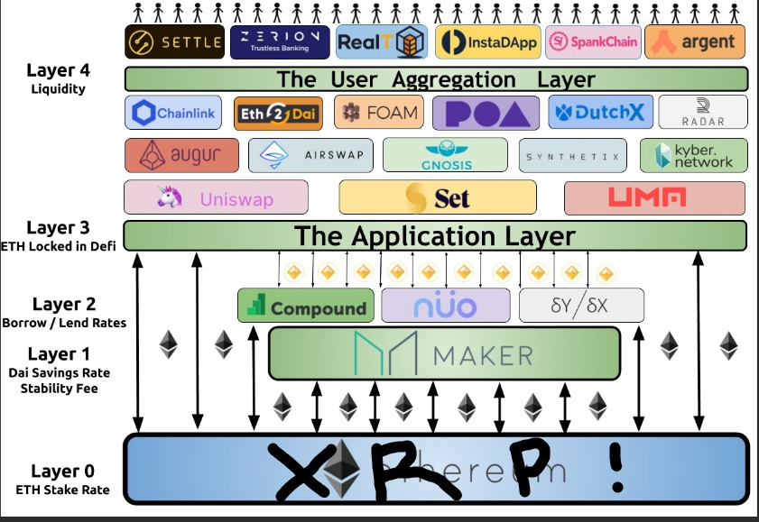

# **BLOCKCHAIN AND CRYPTOCURRENCIES**

---
## Overview and Origin

***Ripple Labs Inc***

[ripple](http://www.ripple.com)

Ripple Labs was co-founded by 

* Jed McCaleb
* Chris Larsen

***Jed McCaleb on left and Chris Larson on right***

The idea for Ripple was created when Chris Larsen figured out how to fill a problem with the current speed and efficiency of our financial system to do cross boarder payments. At the time he was involved with another company, co-founder of E-LOAN, and he teamed up with Jed McCaleb, who previously founded Mt. Gox, to create a new system of remittance utilizing blockchain technology.  

The primary source of funding for Ripple Labs has been from the sales of its native token XRP. According to documentation Ripple had 6 rounds of venture capital funding. 2 angel funds totaling $5.5 million in 2013. Also, in 2013 another $3.5 million was funded by seed funding. In 2015 there was 2 separate Series A type funding totaling $32 million. A series B type funding for $4 million in 2016. The final and largest amount to be funded to the company in a series c was for $299 million dollars. 
    

## Business Activities
---

Ripple Labs is fintech company that provides global payment solutions utilizing blockchain technology. Before this new technology traditional cross-boarder payments were slow, expensive and took days for the transaction to take place. Ripple’s blockchain is the answer to solve these problems and way more, as you will come to see after further reading.  

The targeted intended customer base is the entire financial institutions, such as banks and payment processors/ providers. According to Ripples website, they have already partnered with over 300 companies and are using Ripples technology to send and receive instant payments at fraction of the cost. Serculy, might I add!

A huge advantage that Ripple offers is their open-source blockchain known as XRPL (XRP Ledger). Its super-fast and very secure. As a matter of fact the public ledger that Ripple uses is way more secure and faster than the competition typically using a private ledger.

Another advantage is that Ripple uses several technologies to implement its effectiveness. The XRPL, which we just discussed, and the Interledger Protocol (ILP). This means Ripple’s solution is highly versatile, working with different network payments around the world. Maybe more versatile than the competitors. xVia is an API that enables businesses to send payments across different networks using a single interface.

---
## Landscape

Ripple Labs is in the blockchain domain of fintech but the implications of their blockchain traverse many domains in fintech like paytech (payment and remittance technology) for example. I would classify them as a blockchain domain even though they could be seen as paytech domain of fintech.

In the past 5-10 years several major trends in fintech have emerged, such as blockchains use of the distributed ledger. There is also digital transformation creating new digital payment systems and mobile banking apps. Artificial intelligence is another huge trend that helps with customer service, fraud detection and risk management. AI is even used to create automize trading algorithms to facilitate less exposure in trading of stocks or cryptocurrencies. Defi or decentralized finance is another big trend to emerge from blockchain technology.

Other major companies in this domain includes...
  * Coinbase: A crypto exchange to buy and sell cryptocurrencies.
  *	Binance: A crypto exchange for buying and selling but also its own open-source blockchain 
  *	Chainalysis: Provide analysis of blockchain to government agencies, exchanges, and financial institutions
  * Uniswap: Decentralized exchange that enables users to trade cyprtocurrencies without intermediaries.
  * Compound: Lending platform that enables users to earn interest on the their cryptocurrencies.
  * Aave: A lending platform using DeFi that enables users to borrow and lend cryptocurrencies without intermediaries.

---

## Results

* Ripple has innovated the entire way cross-boarder payments are done as we have seen but the true scope of what this technology can do has been on halt. This is due to a 2 year legal battle with the SEC to determine if XRP is a security or a commodity. As stated before one way the company got funding was from the sale of the native token (XRP), which it raised $1.3 bilion dollars in 2013. They won the lawsuit and was deemed not a security. This litigation has caused congress to look at cryptocurrencies in a new light. 

* In the fintech domains metrics to measure the success of a company is revenue growth, customer acquisition cost, customer retention rate, net promoter score, and market share. Ripple has been reported to be doing very well based on those metrics but to me the indicator of their success is this recent win in the SEC lawsuit.

* The growth has been explosive since the win and Ripple’s token XRP has been listed on many exchanges with a surge nearly a 100% ($0.938) increase in price since July of 2023.

## Recommendations

* Ripple is primarily focused on financial institutions and CBCD’s (Centralized banks Digital Currency). I would suggest that we offer Defi services. They could leverage a platform to offer lending, borrowing, trading, and more to regular everyday customers.
I think that by offering their services to everybody, not just huge companies such as banks and governments, they could make money on more transactions and customers without the intermediaries. It would offer the everyday person make more money on their XRP, which would cause more sales of XRP. It could actually make Ripple bigger and better than any banking system out there. It could do this without having to create much new technology but Ripple issued grants worth over $1 billion at the time for developers building on the XRPL.

